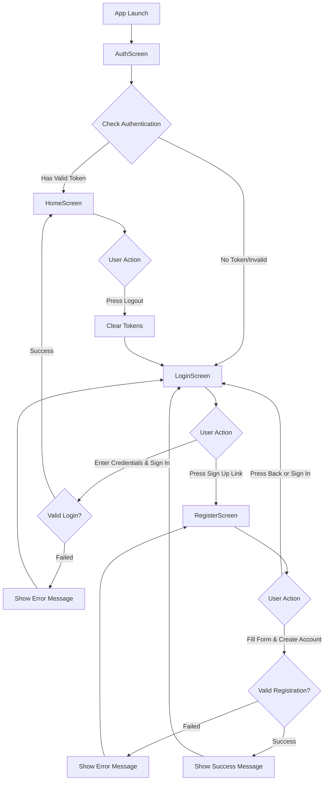
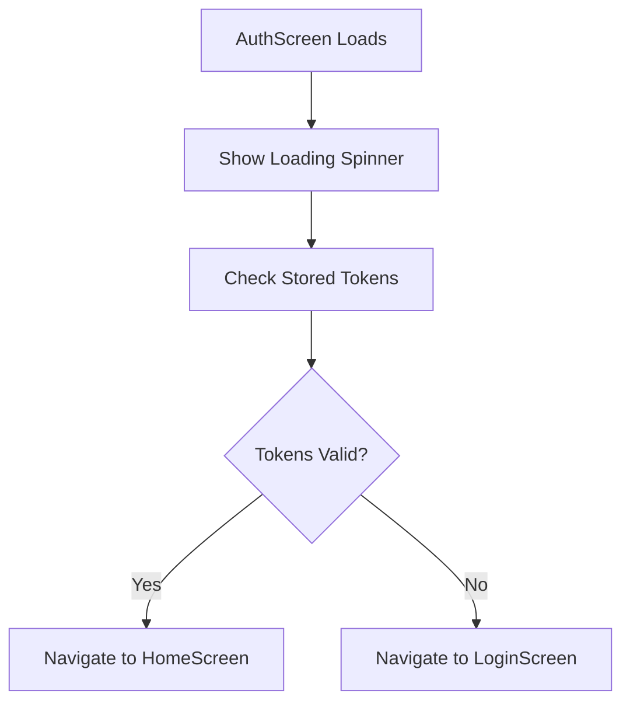
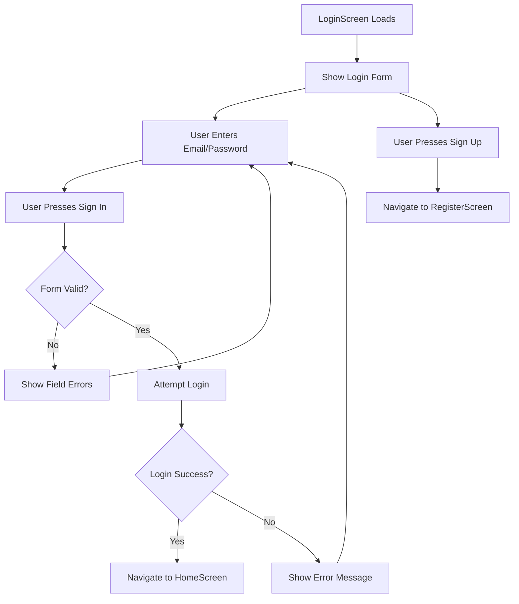
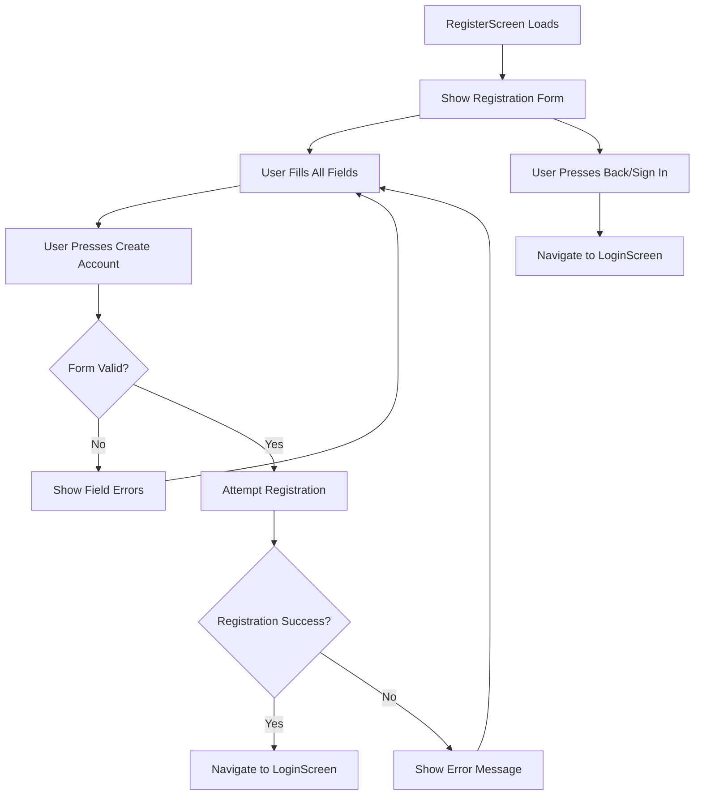

# Cribe App Authentication Screens

Simple documentation about the authentication screens in the Cribe Flutter app - what they do and how they flow together.

## 🔐 Auth Screens Overview

There are 3 main authentication screens that handle the user's journey:

### **AuthScreen** - The Entry Point
- **Purpose**: Checks if user is already logged in when app starts
- **What it does**: Shows loading spinner while checking for stored tokens
- **Decision**: Routes user to either HomeScreen (if authenticated) or LoginScreen (if not)

### **LoginScreen** - Sign In 
- **Purpose**: Allows existing users to sign in
- **What it shows**: Email field, password field, "Sign In" button, "Sign Up" link
- **Actions**: Validates input, attempts login, navigates to HomeScreen on success

### **RegisterScreen** - Sign Up
- **Purpose**: Allows new users to create an account  
- **What it shows**: First name, last name, email, password, confirm password fields, "Create Account" button
- **Actions**: Validates all fields, creates account, navigates back to LoginScreen on success

## 🚀 Screen Flow

## 📱 What Each Screen Does

### AuthScreen Process

### LoginScreen Process  

### RegisterScreen Process

That's it! The auth screens work together to handle user authentication in a simple, clear flow.