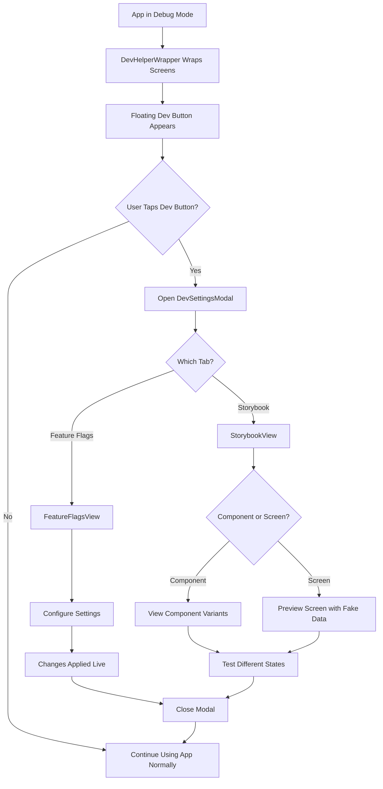
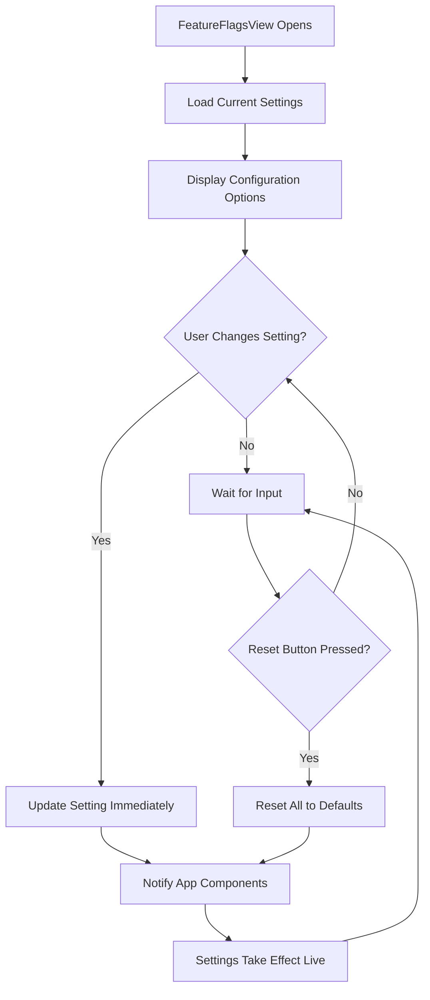
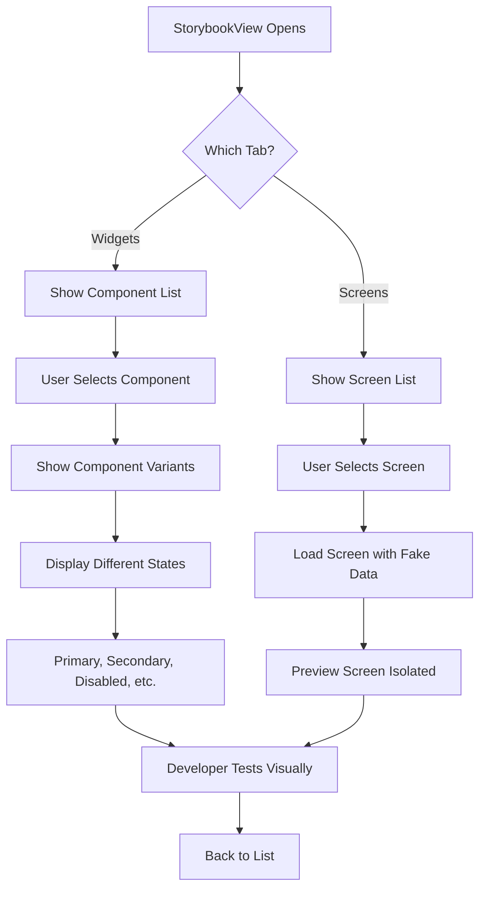
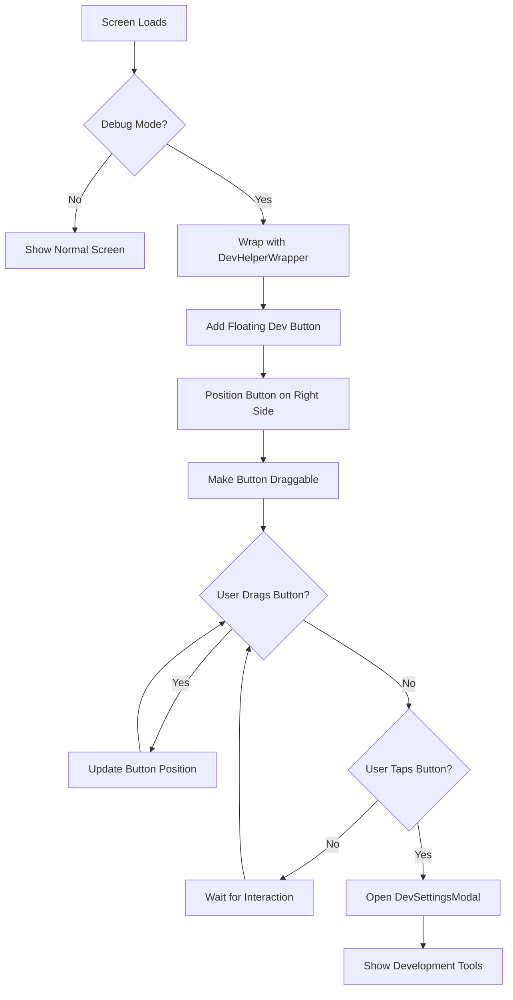

# Cribe App Dev Helper

Simple documentation about the development helper system in the Cribe Flutter app - what it does and how developers use it.

## 🛠️ Dev Helper Overview

The **Dev Helper** system provides development tools that only appear in debug mode. It helps developers test, configure, and preview the app during development.

### **Main Components:**
- **DevHelperWrapper** - Adds a floating dev button to any screen
- **DevSettingsModal** - Main modal with development tools  
- **FeatureFlagsView** - Configure app settings and feature flags
- **StorybookView** - Preview UI components and screens in isolation

## 🚀 Dev Helper Flow

## 🎛️ Feature Flags View

**Purpose**: Configure app settings and feature flags in real-time

### **What it shows:**
- Default email/password fields for quick login
- API endpoint override field
- Log level dropdown (Debug, Info, Warning, Error, None)
- Boolean feature flag toggle
- A/B test variant selector (A or B)
- Reset to defaults button

### **What it does:**

## 📚 Storybook View

**Purpose**: Preview and test UI components and screens in isolation

### **What it shows:**
Two tabs:
- **Widgets Tab**: List of UI components (buttons, text fields, etc.)
- **Screens Tab**: List of app screens (login, register, home)

### **Component Testing Flow:**

### **Available Components:**
- **StyledButton**: Primary, secondary, danger, loading, disabled states
- **StyledText**: All text variants (headline, title, body, etc.)
- **StyledTextField**: Various input types with icons and validation
- **StyledTextButton**: Simple text buttons
- **StyledSwitch**: Toggle switches with labels
- **StyledDropdown**: Dropdown selectors

### **Available Screens:**
- **LoginScreen**: With fake login view model
- **RegisterScreen**: With fake register view model  
- **HomeScreen**: With fake home view model

## 🎯 Dev Helper Wrapper

**Purpose**: Provides access to dev tools from any screen

### **What it does:**

## 🔧 Key Features

### **Debug Mode Only**
- Only appears when app is running in debug mode
- Completely hidden in release builds
- No performance impact on production

### **Floating Access Button**
- Draggable circular button with build icon
- Stays within safe areas (avoids notch/navigation)
- Positioned on right side, 2/3 down the screen
- Always accessible from any screen

### **Live Configuration**
- Feature flag changes apply immediately
- No need to restart app to see changes
- Settings persist across app sessions

### **Component Isolation**
- View components without full app context
- Test different states and variants
- Preview screens with fake data
- Useful for UI development and testing

That's it! The dev helper system makes development faster by providing easy access to configuration and component testing tools.