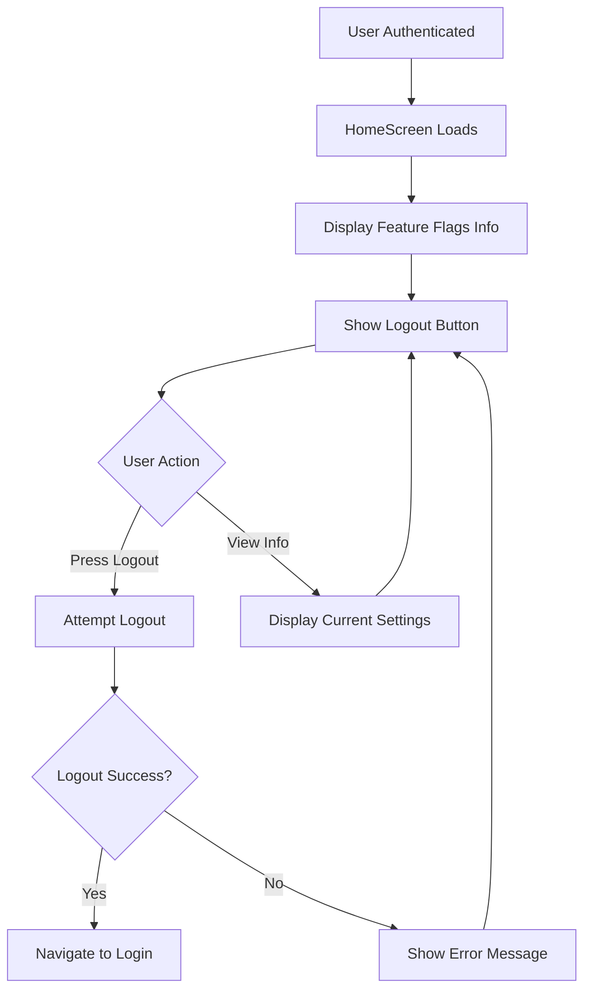
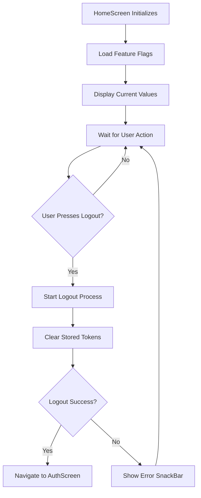

# Cribe App Home Screen

Simple documentation about the home screen in the Cribe Flutter app - what it does and how it works.

## 🏠 Home Screen Overview

The **HomeScreen** is where users land after successful authentication. It's the main screen for logged-in users.

### **What it shows:**
- App bar with "Home" title (no back button)
- Current feature flags display card showing:
  - Boolean flag status (ON/OFF)
  - A/B test variant (A or B)  
  - Current API endpoint URL
- Logout button at the bottom

### **What it does:**
- Displays current feature flag values for debugging/development
- Provides logout functionality to sign users out
- Shows error messages if logout fails
- Navigates back to login after successful logout

## 🚀 Home Screen Flow

## 📱 Home Screen Process

## 🔧 Key Features

### **Feature Flags Display**
- Shows current boolean flag status (ON/OFF)
- Displays A/B test variant (A or B)
- Shows the current API endpoint being used
- Helpful for developers to see current configuration

### **Logout Functionality**  
- Single logout button that clears user session
- Shows loading state during logout process
- Handles errors gracefully with error messages
- Automatically navigates back to login on success

### **Error Handling**
- Displays error messages via SnackBar if logout fails
- Automatically clears errors after showing them
- Maintains user on home screen if logout fails

That's it! The home screen is simple - it shows feature flag info and provides logout functionality.