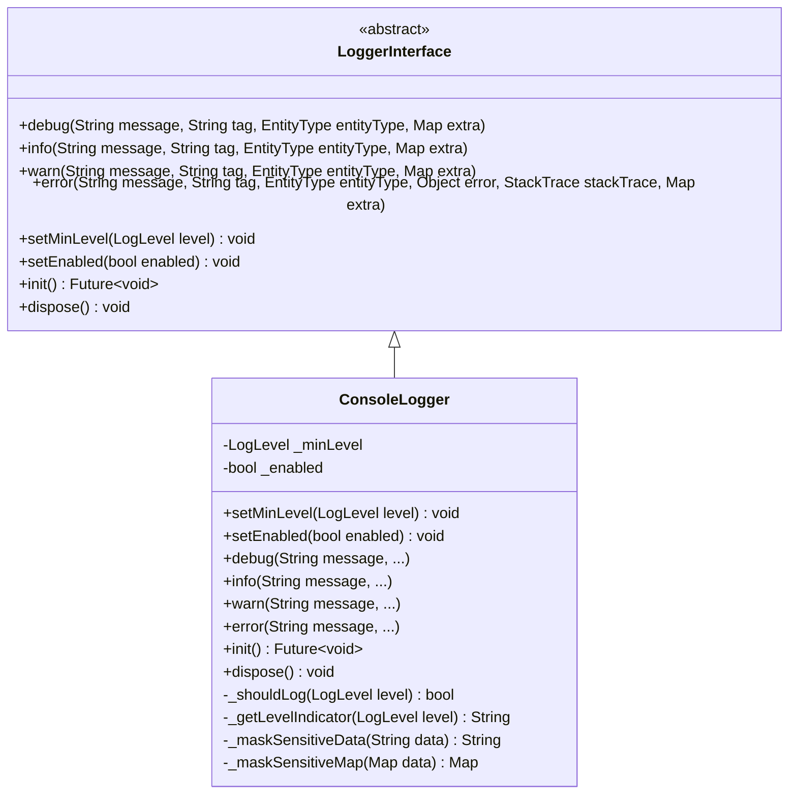
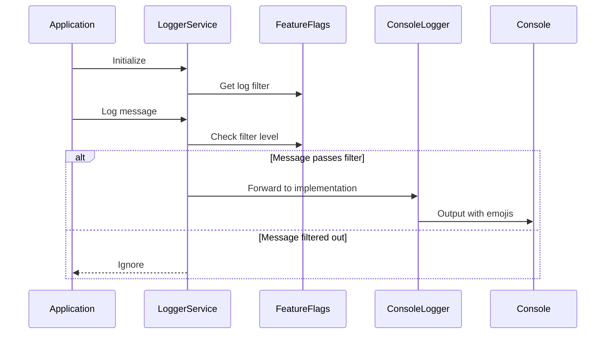
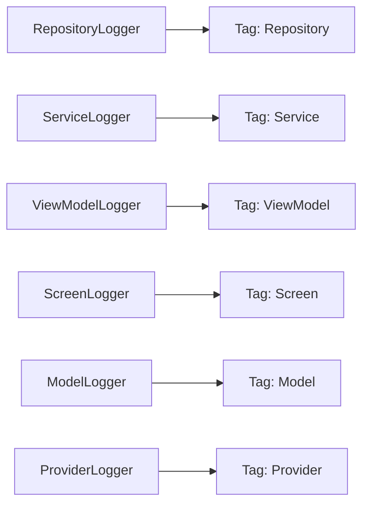
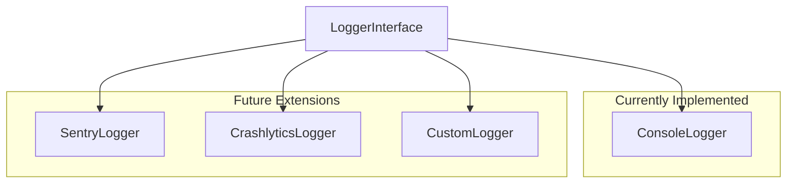
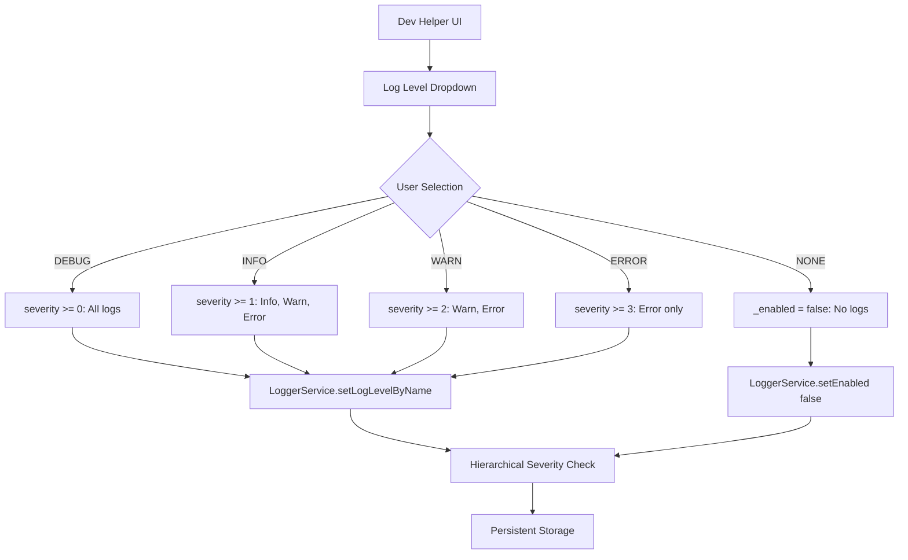

# Logger Architecture Documentation

## Overview

The Cribe application implements a comprehensive, platform-agnostic logging system designed for scalability, flexibility, and ease of use across all application layers.

## Core Components

### 1. LoggerInterface

The abstract interface that defines the contract for all logging implementations.



### 2. LoggerService (Singleton)

Central service that manages logging across the application and integrates with feature flags.



### 3. ContextualLogger & Mixins

Provides convenient access to logging with automatic context injection.

**How it works:**
1. Your class uses a mixin (e.g., `ViewModelLogger`)
2. The mixin provides a `logger` property
3. The logger automatically knows your entity type and class name
4. You just call `logger.info()` and context is added automatically

**Available mixins:**
- `ViewModelLogger` → Tags logs as `[VIEW_MODEL]`
- `ScreenLogger` → Tags logs as `[SCREEN]`
- `ServiceLogger` → Tags logs as `[SERVICE]`
- `RepositoryLogger` → Tags logs as `[REPOSITORY]`
- `ModelLogger` → Tags logs as `[MODEL]`
- `ProviderLogger` → Tags logs as `[PROVIDER]`

## Hierarchical Log Levels & Visual Indicators

The logging system uses severity-based hierarchical filtering where each level includes all higher severity levels:

| Level | Severity | Emoji | Shows | Usage |
|-------|----------|-------|-------|-------|
| DEBUG | 0 | 🔍 | All messages | Development debugging |
| INFO | 1 | ℹ️ | Info, Warn, Error | General information |
| WARN | 2 | ⚠️ | Warn, Error | Warning conditions |
| ERROR | 3 | ❌ | Error only | Error conditions |
| NONE | - | - | Nothing | Disable all logging |

## Security Features

### Sensitive Data Masking

The logger automatically masks sensitive information:

- **Emails**: `user***@exam***`
- **Passwords/Tokens**: `****`
- **Recursive**: Works with nested objects and arrays


## Usage Patterns

### Basic Usage

```dart
class LoginViewModel extends ChangeNotifier with ViewModelLogger {
  Future<void> authenticate() async {
    logger.info('Starting authentication');
    
    try {
      await authRepository.login(email, password);
      logger.info('Authentication successful');
    } catch (e) {
      logger.error('Authentication failed', error: e);
    }
  }
}
```

### Entity Type Automatic Tagging



## Platform Extensions

The logger system is designed to be easily extended with platform-specific implementations:



## File Structure

```
lib/core/logger/
├── logger_interface.dart      # Abstract interface (no LoggerContext)
├── console_logger.dart        # Console implementation with masking
└── logger_mixins.dart         # Entity mixins & ContextualLogger

lib/core/constants/
└── logger_constants.dart      # LogLevel, LogFilter, EntityType

lib/data/services/
└── logger_service.dart        # Central logging service with filtering
```

## Configuration

```bash
# .env file
LOG_LEVEL=INFO  # Options: DEBUG, INFO, WARN, ERROR, NONE
```

### Hierarchical Filtering

The logger uses severity-based filtering:
- **DEBUG**: Shows all messages (debug, info, warn, error)
- **INFO**: Shows info, warn, and error messages
- **WARN**: Shows warn and error messages  
- **ERROR**: Shows only error messages
- **NONE**: Disables all logging

### Feature Flag Configuration

The logger level is managed through the existing feature flag system, allowing runtime configuration through the dev helper UI.

